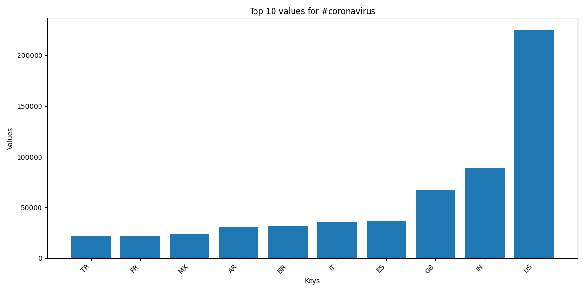
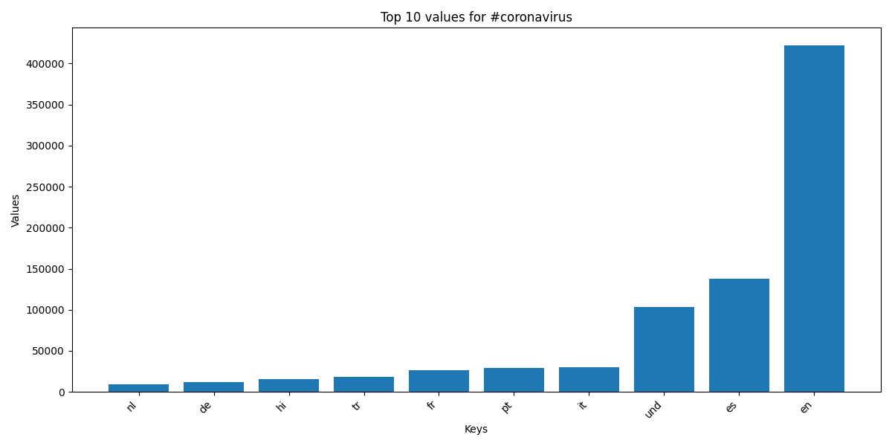
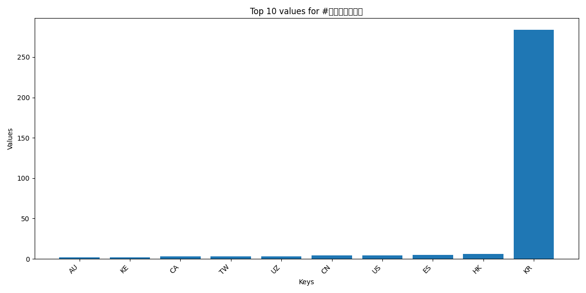
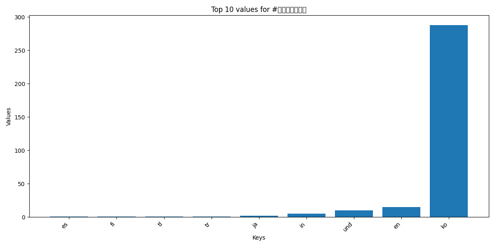
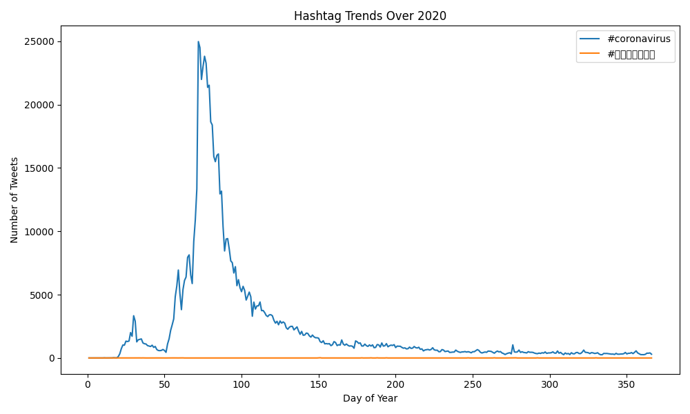

# Coronavirus Twitter Analysis

This project scans all geotagged tweets sent in 2020 to monitor the spread of the coronavirus on social media. 

**Skills Applied:**

- Analyze large scale datasets (~1.1 billion tweets).
- Work with multilingual text and geotags.
- Use Python for data processing and visualization.
- Use MapReduce paradigm to create parallel code.
- Use Matplotlib to generate plots.
- Use JSON for structured data representation.

## Project Overview

1. **Mapper (`map.py`)**: Tracks the usage of the hashtags on a country and language level, creating two files, one for the language dictionary and one for the country dictionary for every day in 2020.
2. **Reduce (`reduce.py`)**: Combine `.lang` files into a single file,
and all of the `.country` files into a different file.
3. **Visualize (`visualize.py`)**: Generate bar graphs showing top 10 countries or languages for a selected hashtag.
4. **Alternative Reduce (`alternative_reduce.py`)**: Generates line plot showing hashtag usage trends over the year.

## Visualizations

Top 10 countries who tweeted `#coronavirus` in 2020. The x-axis is the country and the y-axis is the number of times `#coronavirus` was tweeted. 

Top 10 languages where `#coronavirus` was tweeted in 2020. The x-axis is the language and the y-axis is the number of times `#coronavirus` was tweeted. 

Top 10 countries who tweeted `#코로나바이러스` in 2020. The x-axis is the country and the y-axis is the number of times `#코로나바이러스` was tweeted. 

Top 10 languages were `#코로나바이러스` was tweeted in 2020. The x-axis is the language and the y-axis is the number of times `#코로나바이러스` was tweeted.

Daily hashtag trends for `#coronavirus` and `#코로나바이러스` plotted over the year. The x-axis is the day of the year and the y-axis is the number of tweets on that day containing the hashtag. 

